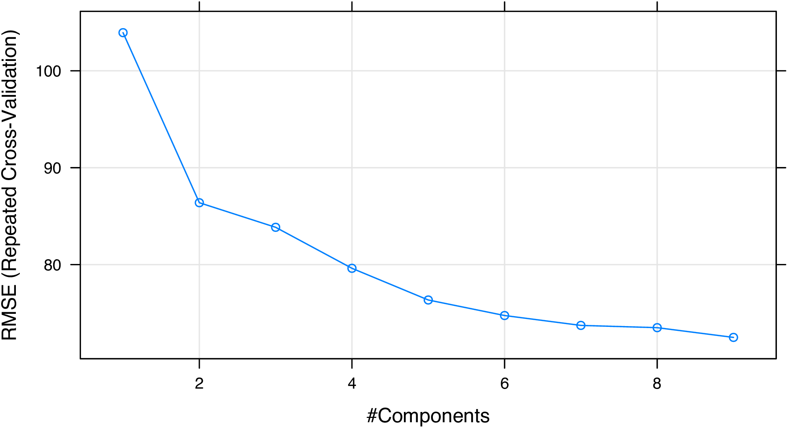
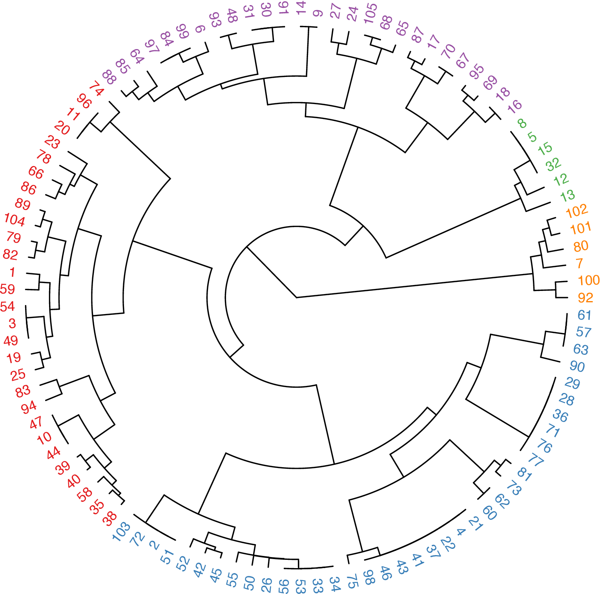
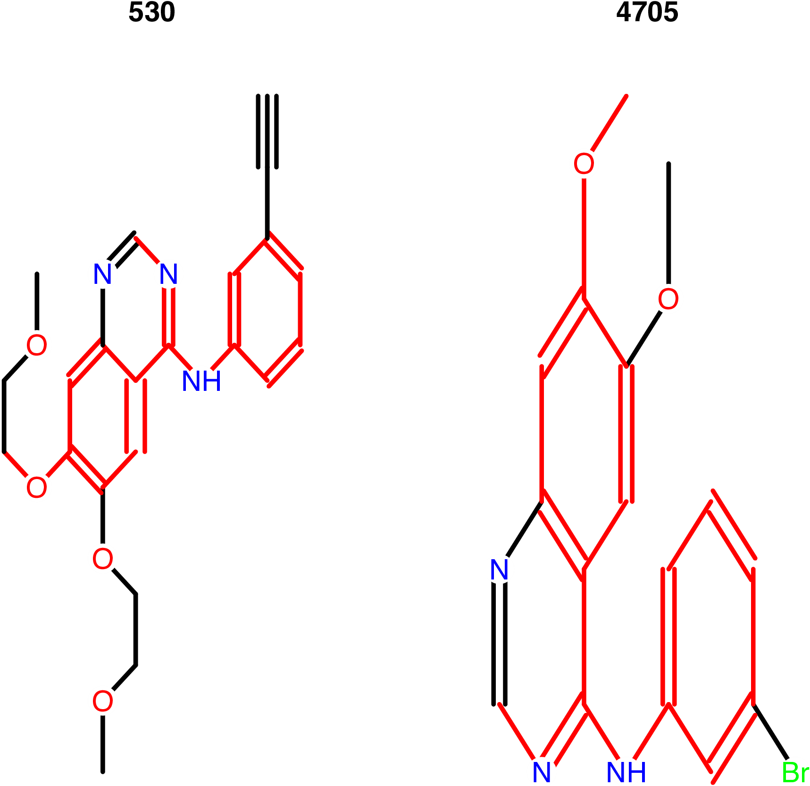

# Introduction

The Rcpi package @Rcpi2015 offers an R/Bioconductor package emphasizing
the comprehensive integration of bioinformatics and chemoinformatics
into a molecular informatics platform for drug discovery.

Rcpi implemented and integrated the state-of-the-art protein sequence
descriptors and molecular descriptors/fingerprints with R. For protein
sequences, the Rcpi package can

- Calculate six protein descriptor groups composed of fourteen types of commonly used structural and physicochemical descriptors that include 9,920 descriptors.
- Calculate profile-based protein representation derived by PSSM (Position-Specific Scoring Matrix).
- Calculate six types of generalized scales-based descriptors derived by various dimensionality reduction methods for proteochemometric (PCM) modeling.
- Parallellized pairwise similarity computation derived by protein sequence alignment and Gene Ontology (GO) semantic similarity measures within a list of proteins.

For small molecules, the Rcpi package can

- Calculate 307 molecular descriptors (2D/3D), including constitutional, topological, geometrical, and electronic descriptors, etc.
- Calculate more than ten types of molecular fingerprints, including FP4 keys, E-state fingerprints, MACCS keys, etc., and parallelized chemical similarity search.
- Parallelized pairwise similarity computation derived by fingerprints and maximum common substructure search within a list of small molecules.

By combining various types of descriptors for drugs and proteins in
different methods, interaction descriptors representing protein-protein
or compound-protein interactions can be conveniently generated with Rcpi,
including:

- Two types of compound-protein interaction (CPI) descriptors
- Three types of protein-protein interaction (PPI) descriptors

Several useful auxiliary utilities are also shipped with Rcpi:

- Parallelized molecule and protein sequence retrieval from several online databases, like PubChem, ChEMBL, KEGG, DrugBank, UniProt, RCSB PDB, etc.
- Loading molecules stored in SMILES/SDF files and loading protein sequences from FASTA/PDB files
- Molecular file format conversion

The computed protein sequence descriptors, molecular descriptors/fingerprints,
interaction descriptors and pairwise similarities are widely used in various
research fields relevant to drug disvery, such as, bioinformatics,
chemoinformatics, proteochemometrics and chemogenomics.

## Installation

To install the Rcpi package, use:

```{r, eval = FALSE}
install.packages("BiocManager")
BiocManager::install("Rcpi")
```

To make the Rcpi package fully functional (especially the Open Babel
related functionalities), we recommend the users also install
the _Enhances_ packages by:

```{r, eval = FALSE}
BiocManager::install("Rcpi", dependencies = c("Imports", "Enhances"))
```

Several dependencies of the Rcpi package may require some system-level
libraries, check the corresponding manuals of these packages for
detailed installation guides.

## How to cite Rcpi

If you feel Rcpi is useful in your research, please cite our paper:

<blockquote>
Dong-Sheng Cao, Nan Xiao, Qing-Song Xu, and Alex F. Chen. (2015). Rcpi: R/Bioconductor package to generate various descriptors of proteins, compounds and their interactions. _Bioinformatics_ 31 (2), 279-281.
</blockquote>

BibTeX entry:

```bibtex
@article{Rcpi2015,
author = {Cao, Dong-Sheng and Xiao, Nan and Xu, Qing-Song and Alex F. Chen.},
title = {{Rcpi: R/Bioconductor package to generate various descriptors
  of proteins, compounds and their interactions}},
journal = {Bioinformatics},
year = {2015},
volume = {31},
number = {2},
pages = {279--281},
doi = {10.1093/bioinformatics/btu624},
issn = {1367-4803},
url = {http://bioinformatics.oxfordjournals.org/content/31/2/279}
}
```

# Applications in Bioinformatics

For bioinformatics research, Rcpi calculates commonly used descriptors
and proteochemometric (PCM) modeling descriptors for protein sequences.
Rcpi also computes pairwise similarities derived by GO semantic
similarity and sequence alignment.

## Predicting protein subcellular localization

Protein subcellular localization prediction involves the computational
prediction of where a protein resides in a cell. It is an important
component of bioinformatics-based prediction of protein function and
genome annotation, and can also aid us to identify novel drug targets.

Here we use the subcellular localization dataset of human proteins
presented in the study of @chou2008cell for a demonstration.
The complete dataset includes 3,134 protein sequences (2,750 different
proteins), classified into 14 human subcellular locations. We selected
two classes of proteins as our benchmark dataset. Class 1 contains
325 _extracell_ proteins, and class 2 includes 307 _mitochondrion_ proteins.

First, we load the Rcpi package, then read the protein sequences stored
in two separated FASTA files with `readFASTA()`:

```{r, eval = FALSE}
library("Rcpi")

# load FASTA files
extracell <- readFASTA(system.file(
  "vignettedata/extracell.fasta",
  package = "Rcpi"
))
mitonchon <- readFASTA(system.file(
  "vignettedata/mitochondrion.fasta",
  package = "Rcpi"
))
```

The loaded sequences are stored as two lists in R, and each component
in the list is a character string representing one protein sequence.
In this case, there are 325 _extracell_ protein sequences and
306 _mitonchon_ protein sequences:

```{r, eval = FALSE}
length(extracell)
```

```{r, eval = FALSE}
## [1] 325
```

```{r, eval = FALSE}
length(mitonchon)
```

```{r, eval = FALSE}
## [1] 306
```

To assure that the protein sequences only have the twenty standard
amino acid types which is required for the descriptor computation,
we use the `checkProt()` function to do the amino acid type sanity
checking and remove the _non-standard_ protein sequences:

```{r, eval = FALSE}
extracell <- extracell[(sapply(extracell, checkProt))]
mitonchon <- mitonchon[(sapply(mitonchon, checkProt))]
```

```{r, eval = FALSE}
length(extracell)
```

```{r, eval = FALSE}
## [1] 323
```

```{r, eval = FALSE}
length(mitonchon)
```

```{r, eval = FALSE}
## [1] 304
```

Two protein sequences were removed from each class. For the remaining
sequences, we calculate the amphiphilic pseudo amino acid composition
(APAAC) descriptor @chouapaac and create class labels for the random
forest classification modeling.

```{r, eval = FALSE}
# calculate APAAC descriptors
x1 <- t(sapply(extracell, extractProtAPAAC))
x2 <- t(sapply(mitonchon, extractProtAPAAC))
x <- rbind(x1, x2)

# make class labels
labels <- as.factor(c(rep(0, length(extracell)), rep(1, length(mitonchon))))
```

In Rcpi, the functions of commonly used descriptors for protein sequences
and proteochemometric (PCM) modeling descriptors are named after
`extractProt...()` and `extractPCM...()`.

Next, we will split the data into a 75% training set and a 25% test set.

```{r, eval = FALSE}
set.seed(1001)

# split training and test set
tr.idx <- c(
  sample(1:nrow(x1), round(nrow(x1) * 0.75)),
  sample(nrow(x1) + 1:nrow(x2), round(nrow(x2) * 0.75))
)
te.idx <- setdiff(1:nrow(x), tr.idx)

x.tr <- x[tr.idx, ]
x.te <- x[te.idx, ]
y.tr <- labels[tr.idx]
y.te <- labels[te.idx]
```

We will train a random forest classification model on the training set with 5-fold cross-validation, using the \pkg{randomForest} package.

```{r, eval = FALSE}
library("randomForest")
rf.fit <- randomForest(x.tr, y.tr, cv.fold = 5)
print(rf.fit)
```

The training result is:

```{r, eval = FALSE}
## Call:
##  randomForest(x = x.tr, y = y.tr, cv.fold = 5)
##                Type of random forest: classification
##                      Number of trees: 500
## No. of variables tried at each split: 8
##
##         OOB estimate of  error rate: 25.11%
## Confusion matrix:
##     0   1 class.error
## 0 196  46   0.1900826
## 1  72 156   0.3157895
```

With the model trained on the training set, we predict on the test set
and plot the ROC curve with the \pkg{pROC} package, as is shown in
Figure 1.

```{r, eval = FALSE}
# predict on test set
rf.pred <- predict(rf.fit, newdata = x.te, type = "prob")[, 1]

# plot ROC curve
library("pROC")
plot.roc(y.te, rf.pred, grid = TRUE, print.auc = TRUE)
```


<p align="center">Figure 1: ROC curve for the test set of protein subcellular localization data</p>

The area under the ROC curve (AUC) is:

```{r, eval = FALSE}
## Call:
## plot.roc.default(x = y.te, predictor = rf.pred, col = "#0080ff",
##                  grid = TRUE, print.auc = TRUE)
##
## Data: rf.pred in 81 controls (y.te 0) > 76 cases (y.te 1).
## Area under the curve: 0.8697
```

# Applications in Chemoinformatics

For chemoinformatics research, Rcpi calculates various types of molecular
descriptors/fingerprints, and computes pairwise similarities derived by
fingerprints and maximum common substructure search. Rcpi also provides
the `searchDrug()` function for parallelized molecular similarity
search based on these similarity types.

## Regression modeling in QSRR study of retention indices

In @yan2012comparison, a quantitative structure-retention relationship
study was performed for 656 flavor compounds on four stationary phases
of different polarities, using constitutional, topological and geometrical
molecular descriptors. The gas chromatographic retention indices (RIs)
of these compounds were accurately predicted using linear models.
Here we choose the molecules and their RIs of one stationary phase
(OV101) as our benchmark dataset.

Since it would be rather tedious to implement the complete cross-validation
procedures, the R package `caret` is used here. To run the R code below,
users need to install the \pkg{caret} package and the required predictive
modeling packages first. The \pkg{caret} package provides a unified
interface for the modeling tuning task across different statistical
machine learning packages. It is particularly helpful in QSAR modeling,
for it contains tools for data splitting, pre-processing, feature selection,
model tuning and other functionalities.

Just like the last section, we load the Rcpi package, and read the
molecules stored in a SMILES file:

```{r, eval = FALSE}
library("Rcpi")

RI.smi <- system.file(
  "vignettedata/RI.smi",
  package = "Rcpi"
)
RI.csv <- system.file(
  "vignettedata/RI.csv",
  package = "Rcpi"
)

x.mol <- readMolFromSmi(RI.smi, type = "mol")
x.tab <- read.table(RI.csv, sep = "\t", header = TRUE)
y <- x.tab$RI
```

The `readMolFromSmi()` function is used for reading molecules from
SMILES files, for molecules stored in SDF files, use `readMolFromSDF()` instead.

The CSV file `RI.csv` contains tabular data for the retention indices,
compound name, and odor information of the compounds. Here we only
extracted the RI values by calling `x.tab$RI`.

After the molecules were properly loaded, we calculate several selected
molecular descriptors. The corresponding functions for molecular descriptor
calculation are all named after `extractDrug...()` in `Rcpi`:

```{r, eval = FALSE}
# calculate selected molecular descriptors
x <- suppressWarnings(cbind(
  extractDrugALOGP(x.mol),
  extractDrugApol(x.mol),
  extractDrugECI(x.mol),
  extractDrugTPSA(x.mol),
  extractDrugWeight(x.mol),
  extractDrugWienerNumbers(x.mol),
  extractDrugZagrebIndex(x.mol)
))
```

After the descriptors were calculated, the result `x` will be a data frame,
each row represents one molecule, and each column is one descriptor (predictor).
The Rcpi package integrated the molecular descriptors and chemical fingerprints
calculated by the `rcdk` package @steinbeck2003chemistry and the
ChemmineOB package @chemmineob.

Next, a partial least squares model will be fitted with the `pls` and
the `caret` package. The cross-validation setting is 5-fold repeated
cross-validation (repeat for 10 times).

```{r, eval = FALSE}
# regression on training set
library("caret")
library("pls")

# cross-validation settings
ctrl <- trainControl(
  method = "repeatedcv", number = 5, repeats = 10,
  summaryFunction = defaultSummary
)

# train a pls model
set.seed(1002)
pls.fit <- train(
  x, y,
  method = "pls", tuneLength = 10, trControl = ctrl,
  metric = "RMSE", preProc = c("center", "scale")
)

# print cross-validation result
print(pls.fit)
```

The cross-validation result is:

```
Partial Least Squares 

297 samples
 10 predictor

Pre-processing: centered (10), scaled (10) 
Resampling: Cross-Validated (5 fold, repeated 10 times) 
Summary of sample sizes: 237, 239, 238, 237, 237, 238, ... 
Resampling results across tuning parameters:

  ncomp  RMSE       Rsquared   MAE     
  1      104.19653  0.8822135  81.30798
  2       88.79911  0.9153172  69.67190
  3       87.65849  0.9169335  68.90654
  4       87.03159  0.9180740  68.45516
  5       84.66035  0.9227619  66.65136
  6       80.29620  0.9309492  62.57300
  7       79.06348  0.9333719  61.51886
  8       78.17443  0.9346922  59.81325
  9       77.68815  0.9353269  59.48581

RMSE was used to select the optimal model using the smallest value.
The final value used for the model was ncomp = 9.
```

We see that the RMSE of the PLS regression model was decreasing when
the number of principal components (`ncomp`) was increasing.
We can plot the components and RMSE to helps us select the desired
number of principal components used in the model.

```{r, eval = FALSE}
# # of components vs RMSE
print(plot(pls.fit, asp = 0.5))
```


<p align="center">Figure 2: Number of principal components vs. RMSE for the PLS regression model</p>

From Figure 2, we consider that selecting six or seven components is acceptable.
At last, we plot the experimental RIs and the predicted RIs to see if the model
fits well on the training set (Figure 3):

```{r, eval = FALSE}
# plot experimental RIs vs predicted RIs
plot(y, predict(pls.fit, x),
  xlim = range(y), ylim = range(y),
  xlab = "Experimental RIs", ylab = "Predicted RIs"
)
abline(a = 0, b = 1)
```


<p align="center">Figure 3: Experimental RIs vs. Predicted RIs</p>

## _In silico_ toxicity classification for drug discovery

In the perspective of quantitative pharmacology, the successful discovery
of novel drugs depends on the pharmacokinetics properties, like
**a**bsorption, **d**istribution, **m**etabolism, and **e**xcretion.
In addition, the potential **t**oxicity of chemical compounds is taken
into account. QSAR or QSPR methods are usually employed to predict the
ADME/T qualities of potential drug candidates.

In @cao2012silico, quantitative structure-toxicity relationship (QSTR)
models were established for classifying five toxicity datasets.
Here we use the maximum recommended daily dose dataset (FDAMDD)
from FDA Center for Drug Evaluation and Research as the benchmark dataset.

First, load the drug molecules stored in a SMILES file into R:

```{r, eval = FALSE}
library("Rcpi")

fdamdd.smi <- system.file("vignettedata/FDAMDD.smi", package = "Rcpi")
fdamdd.csv <- system.file("vignettedata/FDAMDD.csv", package = "Rcpi")

x.mol <- readMolFromSmi(fdamdd.smi, type = "mol")
x.smi <- readMolFromSmi(fdamdd.smi, type = "text")
y <- as.factor(paste0("class", scan(fdamdd.csv)))
```

The object `x.mol` is used for computing the MACCS and E-state fingerprints;
the object `x.smi` is used for computing the FP4 fingerprints.
The 0-1 class labels stored in file `FDAMDD.csv` indicates whether
the drug molecule has high toxicity or not.

Then we calculate three different types of molecular fingerprints
(E-state, MACCS, and FP4) for the drug molecules:

```{r, eval = FALSE}
# calculate molecular fingerprints
x1 <- extractDrugEstateComplete(x.mol)
x2 <- extractDrugMACCSComplete(x.mol)
x3 <- extractDrugOBFP4(x.smi, type = "smile")
```

As the nature of fingerprint-based structure representation,
the calculated 0-1 matrix `x1`, `x2`, and `x3` will be very sparse.
Since there are several columns have nearly exactly the same value
for all the molecules, we should remove them with `nearZeroVar()`
in `caret` before modeling, and split our training set and test set:

```{r, eval = FALSE}
library("caret")

# remove near-zero variance variables
x1 <- x1[, -nearZeroVar(x1)]
x2 <- x2[, -nearZeroVar(x2)]
x3 <- x3[, -nearZeroVar(x3)]

# split training and test set
set.seed(1003)
tr.idx <- sample(1:nrow(x1), round(nrow(x1) * 0.75))
te.idx <- setdiff(1:nrow(x1), tr.idx)
x1.tr <- x1[tr.idx, ]
x1.te <- x1[te.idx, ]
x2.tr <- x2[tr.idx, ]
x2.te <- x2[te.idx, ]
x3.tr <- x3[tr.idx, ]
x3.te <- x3[te.idx, ]
y.tr <- y[tr.idx]
y.te <- y[te.idx]
```

On the training sets, we will train three classification models separately
using SVM (RBF kernel), using the `kernlab` package and the `caret` package.
The cross-validation setting is 5-fold repeated CV (repeat for 10 times).

```{r, eval = FALSE}
# svm classification on training sets
library("kernlab")

# cross-validation settings
ctrl <- trainControl(
  method = "cv", number = 5, repeats = 10,
  classProbs = TRUE,
  summaryFunction = twoClassSummary
)

# SVM with RBF kernel
svm.fit1 <- train(
  x1.tr, y.tr,
  method = "svmRadial", trControl = ctrl,
  metric = "ROC", preProc = c("center", "scale")
)
svm.fit2 <- train(
  x2.tr, y.tr,
  method = "svmRadial", trControl = ctrl,
  metric = "ROC", preProc = c("center", "scale")
)
svm.fit3 <- train(
  x3.tr, y.tr,
  method = "svmRadial", trControl = ctrl,
  metric = "ROC", preProc = c("center", "scale")
)

# print cross-validation result
print(svm.fit1)
print(svm.fit2)
print(svm.fit3)
```

The training result when using E-state fingerprints:

```{r, eval = FALSE}
## Support Vector Machines with Radial Basis Function Kernel
##
## 597 samples
##  23 predictors
##   2 classes: "class0", "class1"
##
## Pre-processing: centered, scaled
## Resampling: Cross-Validated (5 fold)
##
## Summary of sample sizes: 478, 479, 477, 477, 477
##
## Resampling results across tuning parameters:
##
##   C     ROC    Sens   Spec   ROC SD  Sens SD  Spec SD
##   0.25  0.797  0.7    0.765  0.0211  0.0442   0.00666
##   0.5   0.808  0.696  0.79   0.0173  0.059    0.0236
##   1     0.812  0.703  0.781  0.0191  0.0664   0.0228
##
## Tuning parameter "sigma" was held constant at a value of 0.02921559
## ROC was used to select the optimal model using  the largest value.
## The final values used for the model were sigma = 0.0292 and C = 1.
```

We can see that, after removing the near zero variance predictors,
there were only 23 predictors left for the original 79 E-state fingerprints.

The training result when using MACCS keys:

```{r, eval = FALSE}
## Support Vector Machines with Radial Basis Function Kernel
##
## 597 samples
## 126 predictors
##   2 classes: "class0", "class1"
##
## Pre-processing: centered, scaled
## Resampling: Cross-Validated (5 fold)
##
## Summary of sample sizes: 477, 477, 477, 478, 479
##
## Resampling results across tuning parameters:
##
##   C     ROC    Sens   Spec   ROC SD  Sens SD  Spec SD
##   0.25  0.834  0.715  0.775  0.0284  0.0994   0.0589
##   0.5   0.848  0.726  0.79   0.0299  0.065    0.0493
##   1     0.863  0.769  0.793  0.0307  0.0229   0.0561
##
## Tuning parameter "sigma" was held constant at a value of 0.004404305
## ROC was used to select the optimal model using  the largest value.
## The final values used for the model were sigma = 0.0044 and C = 1.
```

There are 126 predictors left for the original 166 MACCS keys
after removing the near-zero variance predictors.
The model performance by AUC values is slightly
better than using the E-state fingerprints.

The training result when using FP4 fingerprints:

```{r, eval = FALSE}
## Support Vector Machines with Radial Basis Function Kernel
##
## 597 samples
##  58 predictors
##   2 classes: "class0", "class1"
##
## Pre-processing: centered, scaled
## Resampling: Cross-Validated (5 fold)
##
## Summary of sample sizes: 478, 478, 477, 478, 477
##
## Resampling results across tuning parameters:
##
##   C     ROC    Sens   Spec   ROC SD  Sens SD  Spec SD
##   0.25  0.845  0.769  0.746  0.0498  0.0458   0.0877
##   0.5   0.856  0.744  0.777  0.0449  0.0148   0.0728
##   1     0.863  0.751  0.777  0.0428  0.036    0.0651
##
## Tuning parameter "sigma" was held constant at a value of 0.01077024
## ROC was used to select the optimal model using  the largest value.
## The final values used for the model were sigma = 0.0108 and C = 1.
```

There are 58 predictors left for the original 512 FP4
fingerprints after the screening. The model performance
by AUC values is almost the same comparing to using MACCS keys,
and better than using E-state fingerprints.

We predict on the test sets with the established models,
and plot the ROC curves in one figure, as is shown in Figure 4.

```{r, eval = FALSE}
# predict on test set
svm.pred1 <- predict(svm.fit1, newdata = x1.te, type = "prob")[, 1]
svm.pred2 <- predict(svm.fit2, newdata = x2.te, type = "prob")[, 1]
svm.pred3 <- predict(svm.fit3, newdata = x3.te, type = "prob")[, 1]

# generate colors
library("RColorBrewer")
pal <- brewer.pal(3, "Set1")

# ROC curves of different fingerprints
library("pROC")
plot(smooth(roc(y.te, svm.pred1)), col = pal[1], grid = TRUE)
plot(smooth(roc(y.te, svm.pred2)), col = pal[2], grid = TRUE, add = TRUE)
plot(smooth(roc(y.te, svm.pred3)), col = pal[3], grid = TRUE, add = TRUE)
```


<p align="center">Figure 4: Smoothed ROC curves for different fingerprint types</p>

## Clustering of molecules based on structural similarities

Apart from supervised methods (classification and regression),
unsupervised approaches, like clustering, is also widely applied
in the quantitative research of drugs.

In reality, there are usually too many chemical compounds available
for identifying drug-like molecules. Thus it would be attractive
using clustering methods to aid the selection of a representative
subset of all available compounds. For a clustering approach that
groups compounds together by their structural similarity, applying
the principle _similar compounds have similar properties_ means that
we only need to test the representative compounds from each individual
cluster, rather than do the time-consuming complete set of experiments,
and this should be sufficient to understand the structure-activity
relationships of the whole compound set.

The Rcpi package provides easy-to-use functions for computing
the similarity between small molecules derived by molecular
fingerprints and maximum common substructure search.

As a example, the SDF file `tyrphostin.sdf` below is a database
composed by searching _tyrphostin_ in PubChem and filtered
by _Lipinski"s rule of five_. We load this SDF file
using `readMolFromSDF()`:

```{r, eval = FALSE}
library("Rcpi")
mols <- readMolFromSDF(system.file(
  "compseq/tyrphostin.sdf",
  package = "Rcpi"
))
```

Then we compute the E-state fingerprints for all the molecules using
`extractDrugEstate()`, and calculate their pairwise similarity matrix
with `calcDrugFPSim()`:

```{r, eval = FALSE}
simmat <- diag(length(mols))

for (i in 1:length(mols)) {
  for (j in i:length(mols)) {
    fp1 <- extractDrugEstate(mols[[i]])
    fp2 <- extractDrugEstate(mols[[j]])
    tmp <- calcDrugFPSim(fp1, fp2, fptype = "compact", metric = "tanimoto")
    simmat[i, j] <- tmp
    simmat[j, i] <- tmp
  }
}
```

With the computed similarity matrix `simmat`, we will try to
cluster the molecules using hierarchical clustering, then
visualize the clustering result:

```{r, eval = FALSE}
mol.hc <- hclust(as.dist(1 - simmat), method = "ward.D")

library("ape") # tree visualization of clusters
clus5 <- cutree(mol.hc, 5) # cut dendrogram into 5 clusters

# generate colors
library("RColorBrewer")
pal5 <- brewer.pal(5, "Set1")
plot(as.phylo(mol.hc),
  type = "fan",
  tip.color = pal5[clus5],
  label.offset = 0.1, cex = 0.7
)
```

The hierarchical clustering result for these molecules is shown in Figure 5.


<p align="center">Figure 5: Tree visualization of the molecular clustering result</p>

## Structure-based chemical similarity searching

Structure-based chemical similarity searching ranks molecules in a
database by their similarity degree to one query molecule structure.
The numerical similarity value is usually computed based on the molecular
fingerprints with selected metrics or by maximum common structure search.
It is one of the core techniques for ligand-based virtual screening
in drug discovery.

The SDF file `DB00530.sdf` below is retrieved from DrugBank,
the drug ID DB00530 is _Erlotinib_, which is a reversible
tyrosine kinase inhibitor. Given this molecule as the query molecule,
we will do a similarity searching in the database `tyrphostin.sdf`
presented in the last subsection.

```{r, eval = FALSE}
library("Rcpi")

mol <- system.file("compseq/DB00530.sdf", package = "Rcpi")
moldb <- system.file("compseq/tyrphostin.sdf", package = "Rcpi")
```

We can do parallelized drug molecular similarity search with the
`searchDrug()` function in Rcpi. Here we choose the
search criterion to be MACCS keys with cosine similarity, FP2
fingerprints with tanimoto similarity, and maximum common
substructure search with tanimoto similarity.

```{r, eval = FALSE}
rank1 <- searchDrug(
  mol, moldb,
  cores = 4, method = "fp",
  fptype = "maccs", fpsim = "tanimoto"
)
rank2 <- searchDrug(
  mol, moldb,
  cores = 4, method = "fp",
  fptype = "fp2", fpsim = "cosine"
)
rank3 <- searchDrug(
  mol, moldb,
  cores = 4, method = "mcs",
  mcssim = "tanimoto"
)
```

The returned search result is stored as a numerical vector,
the name of each element is the molecule number in the database,
and the value is the similarity value between the query molecule
and this molecule. We print the top search results here:

```{r, eval = FALSE}
head(rank1)
##        92       100        83       101         1        36
## 0.6491228 0.6491228 0.5882353 0.5660377 0.5000000 0.4861111

head(rank2)
##       100        92        83       101        94        16
## 0.8310005 0.8208663 0.5405856 0.5033150 0.4390790 0.4274081

head(rank3)
##        92       100        23        39        94        64
## 0.7000000 0.7000000 0.4000000 0.4000000 0.4000000 0.3783784
```

The Rcpi package also integrated the functionality of converting
molecular file formats. For example, we can convert the SDF files
to SMILES files using `convMolFormat()`. Since the #92 molecule
ranks the highest in the three searches performed, we
will calculate the similarity derived by maximum common substructure
search between the query molecule and the #92 molecule using
`calcDrugMCSSim()`:

```{r, eval = FALSE}
# convert SDF format to SMILES format
convMolFormat(
  infile = mol, outfile = "DB00530.smi", from = "sdf", to = "smiles"
)
convMolFormat(
  infile = moldb, outfile = "tyrphostin.smi", from = "sdf", to = "smiles"
)

smi1 <- readLines("DB00530.smi")
smi2 <- readLines("tyrphostin.smi")[92] # select the #92 molecule
calcDrugMCSSim(smi1, smi2, type = "smile", plot = TRUE)
```

The MCS search result is stored in a list, which contains the original
MCS result provided by the `fmcsR` package @wang2013fmcsr, the Tanimoto
coefficient and the overlap coefficient.

```{r, eval = FALSE}
## [[1]]
## An instance of "MCS"
##  Number of MCSs: 1
##  530: 29 atoms
##  4705: 22 atoms
##  MCS: 18 atoms
##  Tanimoto Coefficient: 0.54545
##  Overlap Coefficient: 0.81818
##
## [[2]]
## Tanimoto_Coefficient
##            0.5454545
##
## [[3]]
## Overlap_Coefficient
##           0.8181818
```

By using `calcDrugMCSSim(..., plot = TRUE)`, the maximum common
substructure of the two molecules is presented in Figure 6.


<p align="center">Figure 6: Maximum common structure of the query molecule and the #92 molecule in the chemical database</p>

# Applications in Chemogenomics

For chemogenomics modeling, Rcpi calculates compound-protein interaction
(CPI) descriptors and protein-protein interaction (PPI) descriptors.

## Predicting drug-target interaction by integrating chemical and genomic spaces

The prediction of novel interactions between drugs and target proteins
is a key area in genomic drug discovery. In this example, we use the
G Protein-Coupled Receptor (GPCR) dataset provided by
@yamanishi2008prediction as our benchmark dataset.

A drug-target interaction network can be naturally modeled as a
bipartite graph, where the nodes are target proteins or drug
molecules and edges (only drugs and proteins could be connected
by edges) represent drug-target interactions. Initially,
the graph only contains edges describing the _real_ drug-target
interactions determined by experiments or other ways. In this example,
all real drug-target interaction pairs (i.e., 635 drug-target interactions)
are used as the positive samples. For negative samples we select random,
non-interacting pairs from these drugs and proteins.
They are constructed as follows:

1. Separate the pairs in the above positive samples into single drugs and proteins;
2. Re-couple these singles into pairs in a way that none of them occurs in the corresponding positive dataset.

Ten generated negative sets were used in @cao2012large, here we only used
one of them for a demonstration. The drug ID and target ID is stored in
`GPCR.csv`. The first column is KEGG protein ID, and the second column
is KEGG drug ID. The first 635 rows form the positive set, and the last
635 rows form the negative set.

```{r, eval = FALSE}
library("Rcpi")

gpcr <- read.table(system.file(
  "vignettedata/GPCR.csv",
  package = "Rcpi"
),
header = FALSE, as.is = TRUE
)
```

Take a look at the data:

```{r, eval = FALSE}
head(gpcr)
```

```{r, eval = FALSE}
##          V1     V2
## 1 hsa:10161 D00528
## 2 hsa:10800 D00411
## 3 hsa:10800 D01828
## 4 hsa:10800 D05129
## 5 hsa:11255 D00234
## 6 hsa:11255 D00300
```

We will visualize the network first. Figure 7 shows the connection
pattern for the GPCR drug-target interaction network in the form
of an _arc diagram_.

```{r, eval = FALSE}
library("igraph")
library("arcdiagram")
library("reshape")

g <- graph.data.frame(gpcr[1:(nrow(gpcr) / 2), ], directed = FALSE)
edgelist <- get.edgelist(g)
vlabels <- V(g)$name
vgroups <- c(rep(0, 95), rep(1, 223))
vfill <- c(rep("#8B91D4", 95), rep("#B2C771", 223))
vborders <- c(rep("#6F74A9", 95), rep("#8E9F5A", 223))
degrees <- degree(g)

xx <- data.frame(vgroups, degrees, vlabels, ind = 1:vcount(g))
yy <- arrange(xx, desc(vgroups), desc(degrees))
new.ord <- yy$ind

arcplot(
  edgelist,
  ordering = new.ord, labels = vlabels,
  cex.labels = 0.1, show.nodes = TRUE,
  col.nodes = vborders, bg.nodes = vfill,
  cex.nodes = log10(degrees) + 0.1,
  pch.nodes = 21, line = -0.5, col.arcs = hsv(0, 0, 0.2, 0.25)
)
```


<p align="center">Figure 7: Arc diagram visualization of the GPCR drug-target interaction network</p>

An arc diagram visualize the nodes in the network in a one-dimensional
layout, while using circular arcs to represent edges. With a good ordering
of nodes, it is easy to identify cliques and bridges.

Next, we will download the target protein sequences (in FASTA format) and
drug molecule (in SMILES format) from the KEGG database, in parallel:

```{r, eval = FALSE}
library("Rcpi")

gpcr <- read.table(system.file(
  "vignettedata/GPCR.csv",
  package = "Rcpi"
),
header = FALSE, as.is = TRUE
)

protid <- unique(gpcr[, 1])
drugid <- unique(gpcr[, 2])

protseq <- getSeqFromKEGG(protid, parallel = 5)
drugseq <- getSmiFromKEGG(drugid, parallel = 50)
```

If the connection is slow or accidentally interrupts,
just try a few more times until success.

The functions in Rcpi named after `getMolFrom...()` and `getSmiFrom...()`
supports the parallelized retrieval of (drug) molecules from PubChem,
ChEMBL, CAS, KEGG, and DrugBank. The functions named after `getSeqFrom...()`,
`getFASTAFrom...()`, and `getPDBFrom...()` supports the parallelized
retrieval of proteins from UniProt, KEGG and RCSB PDB.
The functions `getDrug()` and `getProt()` are two integrated wrapper
functions for downloading the molecules and protein sequences from
these online databases.

After the sequences were downloaded, we can calculate the protein
sequence descriptors and molecular descriptors for the targets and drugs:

```{r, eval = FALSE}
x0.prot <- cbind(
  t(sapply(unlist(protseq), extractProtAPAAC)),
  t(sapply(unlist(protseq), extractProtCTriad))
)

x0.drug <- cbind(
  extractDrugEstateComplete(readMolFromSmi(textConnection(drugseq))),
  extractDrugMACCSComplete(readMolFromSmi(textConnection(drugseq))),
  extractDrugOBFP4(drugseq, type = "smile")
)
```

Since the descriptors is only for the _deduplicated_ drug and target list,
we need to generate the full descriptor matrix for the training data:

```{r, eval = FALSE}
# generate drug x / protein x / y
x.prot <- matrix(NA, nrow = nrow(gpcr), ncol = ncol(x0.prot))
x.drug <- matrix(NA, nrow = nrow(gpcr), ncol = ncol(x0.drug))
for (i in 1:nrow(gpcr)) x.prot[i, ] <- x0.prot[which(gpcr[, 1][i] == protid), ]
for (i in 1:nrow(gpcr)) x.drug[i, ] <- x0.drug[which(gpcr[, 2][i] == drugid), ]

y <- as.factor(c(rep("pos", nrow(gpcr) / 2), rep("neg", nrow(gpcr) / 2)))
```

Generate drug-target interaction descriptors using `getCPI()`.

```{r, eval = FALSE}
x <- getCPI(x.prot, x.drug, type = "combine")
```

The pairwise interaction is another useful type of representation in
drug-target prediction, protein-protein interaction prediction and
related research. Rcpi also provides `getPPI()` to generate
protein-protein interaction descriptors. `getPPI()` provides
three types of interactions while `getCPI()` provides two types.
The argument `type` is used to control this.

### Compound-protein interaction (CPI) descriptors

For compound descriptor vector $d_1^{1 \times p_1}$ and the protein
descriptor vector $d_2^{1 \times p_2}$, there are two methods for
construction of descriptor vector $d$ for compound-protein interaction:

1. `type = "combine"` - combine the two feature matrix, $d$ has $p_1 + p_2$ columns;
2. `type = "tensorprod"` - column-by-column (pseudo)-tensor product type interactions, $d$ has $p_1 \times p_2$ columns.

### Protein-protein interaction (PPI) descriptors

For interaction protein A and protein B, let $d_1^{1 \times p}$ and
$d_2^{1 \times p}$ be the descriptor vectors. There are three methods
to construct the protein-protein interaction descriptor $d$:

1. `type = "combine"` - combine the two descriptor matrix, $d$ has $p + p$ columns;
2. `type = "tensorprod"` - column-by-column (pseudo)-tensor product type interactions, $d$ has $p \times p$ columns;
3. `type = "entrywise"` - entrywise product and entrywise sum of the two matrices, then combine them, $d$ has $p + p$ columns.

Train a random forest classification model with 5-fold repeated CV:

```{r, eval = FALSE}
library("caret")
x <- x[, -nearZeroVar(x)]

# cross-validation settings
ctrl <- trainControl(
  method = "cv", number = 5, repeats = 10,
  classProbs = TRUE,
  summaryFunction = twoClassSummary
)

# train a random forest classifier
library("randomForest")

set.seed(1006)
rf.fit <- train(
  x, y,
  method = "rf", trControl = ctrl,
  metric = "ROC", preProc = c("center", "scale")
)
```

Print the cross-validation result:

```
print(rf.fit)
```

```{r, eval = FALSE}
## Random Forest
##
## 1270 samples
##  562 predictors
##    2 classes: "neg", "pos"
##
## Pre-processing: centered, scaled
## Resampling: Cross-Validated (5 fold)
##
## Summary of sample sizes: 1016, 1016, 1016, 1016, 1016
##
## Resampling results across tuning parameters:
##
##   mtry  ROC    Sens   Spec   ROC SD  Sens SD  Spec SD
##   2     0.83   0.726  0.778  0.0221  0.044    0.0395
##   33    0.882  0.795  0.82   0.018   0.0522   0.0443
##   562   0.893  0.822  0.844  0.0161  0.0437   0.0286
##
## ROC was used to select the optimal model using  the largest value.
## The final value used for the model was mtry = 562.
```

Predict on the training set (for demonstration purpose only) and plot ROC curve.

```{r, eval = FALSE}
rf.pred <- predict(rf.fit$finalModel, x, type = "prob")[, 1]

library("pROC")
plot(smooth(roc(y, rf.pred)), grid = TRUE, print.auc = TRUE)
```

The ROC curve is shown in Figure 8.


<p align="center">Figure 8: ROC curve for predicting on the training set of the GPCR drug-target interaction dataset using random forest</p>

# References
